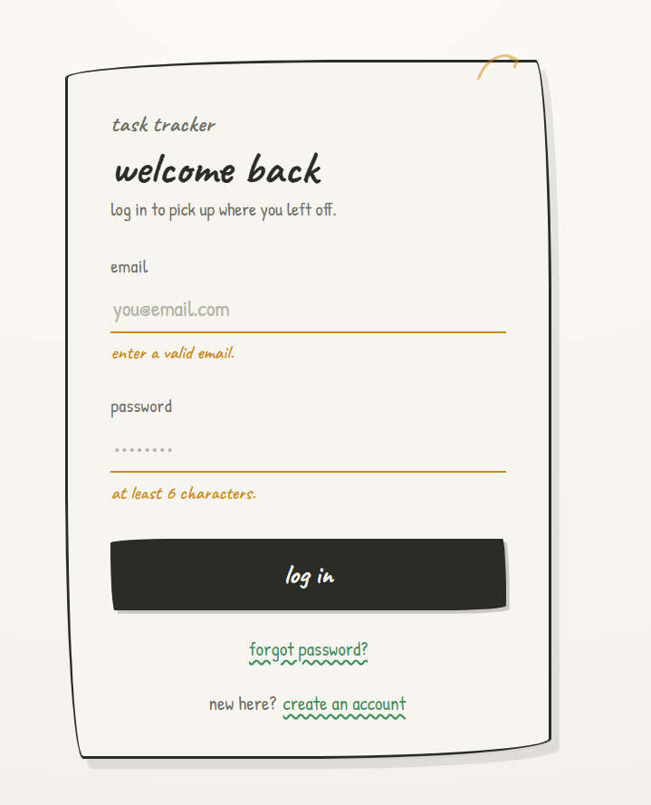
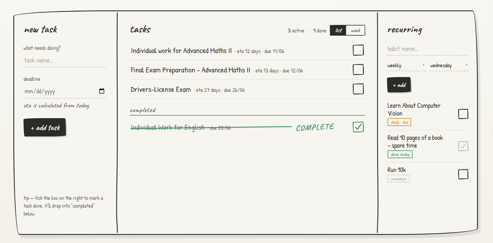
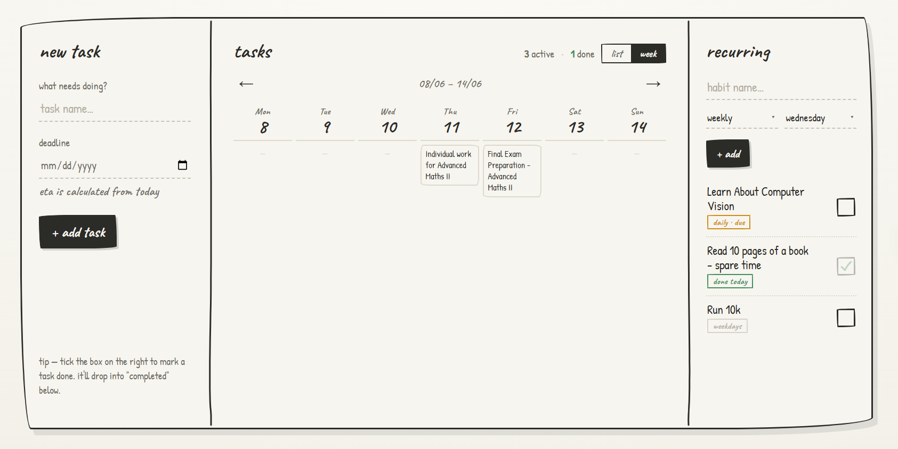
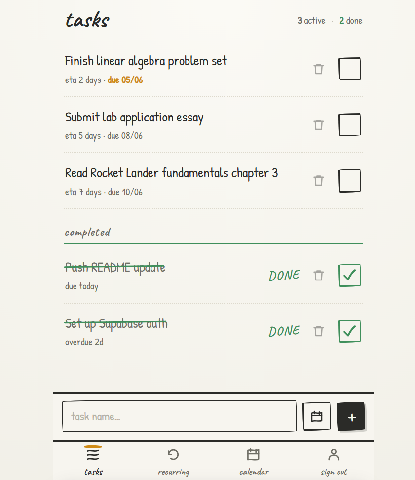
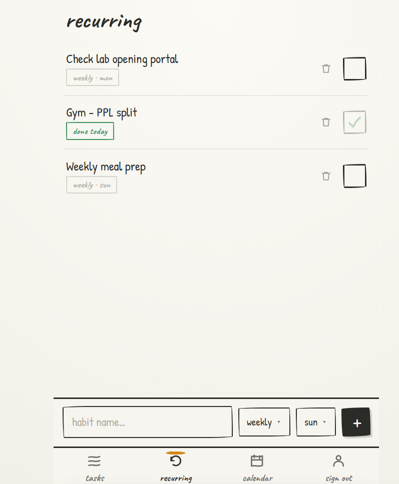
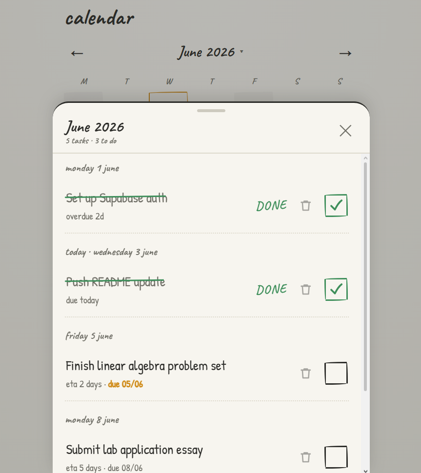
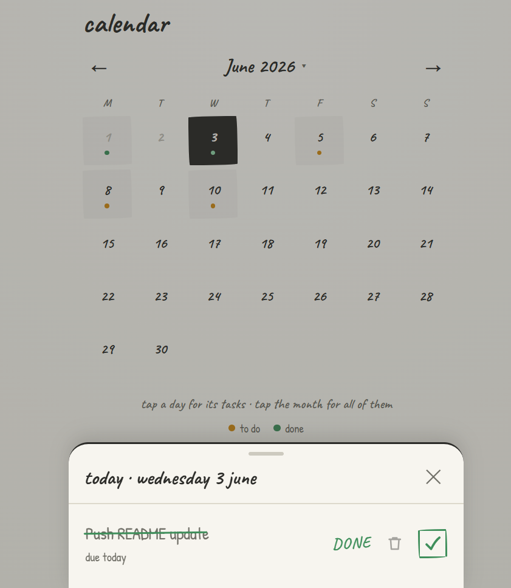

# Task Tracker

A personal task and habit tracker with a hand-drawn, notebook-style interface. Started life as a single vanilla HTML file and grew into a full-stack app with accounts, cloud sync, two responsive layouts, and daily email reminders.

**Live:** https://task-tracker-navy-five-21.vercel.app

---

## Screenshots

      

- **Login** — sticky-note card with a paperclip doodle
- **Desktop** — three-column layout: add task · task list (list/week toggle) · recurring habits
- **Mobile** — swipeable tabs: tasks · recurring · calendar, with sticky bottom input bars
- **Calendar** — month grid with per-day task dots; tap a day or the month header to see what's due

---

## Features

- **One-off tasks** with optional deadlines — live ETA ("3 days", "~2 months"), due-soon and overdue flags
- **Smart sorting** — active tasks by nearest deadline; completed tasks by most recently finished
- **Recurring habits** — daily, weekdays, weekly (pick a day), monthly; resets each cycle and tracks whether it's due today
- **Desktop views** — flat task list and a navigable 7-day week grid
- **Mobile calendar** — month grid with a bottom sheet showing a day's tasks, or the whole month at once
- **Auth** — email/password signup, login, and a full password-reset flow (all via Supabase)
- **Cloud sync** — tasks tied to your account, available on any device, protected per-user with Row Level Security
- **Daily email reminders** — a Vercel cron job emails you each morning about tasks due the next day (via Resend)
- **Responsive** — desktop layout above 900px, swipeable mobile app below, sharing one data layer

---

## Tech

- **Next.js 16** (App Router) + **TypeScript**
- **Supabase** — Postgres, Auth, Row Level Security
- **Resend** — transactional email for deadline reminders
- **Vercel** — hosting + cron scheduling
- **Custom hand-drawn CSS** — Caveat & Patrick Hand fonts, sketch borders, ink/paper palette

---

## Architecture notes

- `app/page.tsx` lifts all Supabase data fetching into shared state, then renders either `DesktopApp` or `MobileApp` based on a `useWindowWidth` check — both UIs run off a single Supabase connection.
- `proxy.ts` (Next.js middleware) guards every route, redirecting unauthenticated users to `/login`, while explicitly excluding the cron API path.
- The reminder endpoint uses the Supabase **service role** key (server-only) to read across users, groups due tasks per user, and sends one email each via Resend.

---

## Running locally

```bash
git clone https://github.com/uzeyir-bayramli-3379/task-tracker.git
cd task-tracker
npm install
```

Create a `.env.local` in the root:

```env
NEXT_PUBLIC_SUPABASE_URL=your_supabase_project_url
NEXT_PUBLIC_SUPABASE_ANON_KEY=your_supabase_anon_key

# server-only — needed for the reminder cron
SUPABASE_SERVICE_ROLE_KEY=your_service_role_key
RESEND_API_KEY=your_resend_key
CRON_SECRET=any_random_string
```

Then:

```bash
npm run dev
# visit http://localhost:3000
```

---

## Database setup

Run once in the Supabase SQL editor:

```sql
-- Tasks
create table if not exists public.tasks (
  id           uuid primary key default gen_random_uuid(),
  user_id      uuid not null references auth.users (id) on delete cascade default auth.uid(),
  name         text not null,
  deadline     date,
  done         boolean not null default false,
  completed_at timestamptz,
  created_at   timestamptz not null default now()
);

alter table public.tasks enable row level security;
create policy "tasks are private to their owner"
  on public.tasks for all
  using (auth.uid() = user_id)
  with check (auth.uid() = user_id);

-- Recurring habits
create table if not exists public.recurring (
  id         uuid primary key default gen_random_uuid(),
  user_id    uuid not null references auth.users (id) on delete cascade default auth.uid(),
  name       text not null,
  freq       text not null check (freq in ('daily', 'weekdays', 'weekly', 'monthly')),
  weekday    int  not null default 0,
  last_done  date,
  created_at timestamptz not null default now()
);

alter table public.recurring enable row level security;
create policy "recurring habits are private to their owner"
  on public.recurring for all
  using (auth.uid() = user_id)
  with check (auth.uid() = user_id);
```

> **Email reminders note:** Resend's test sender (`onboarding@resend.dev`) only delivers to your own account email. To send to anyone, add a verified domain in Resend and swap the `from` address in `app/api/send-reminders/route.ts`.

---

## Project structure

```
task-tracker/
├── app/
│   ├── layout.tsx              # fonts, metadata, viewport
│   ├── page.tsx                # responsive root — DesktopApp or MobileApp
│   ├── DesktopApp.tsx          # three-column desktop layout
│   ├── MobileApp.tsx           # swipeable tab layout
│   ├── shared.ts               # shared helpers (date utils, etc.)
│   ├── globals.css             # hand-drawn sketch styles
│   ├── login/page.tsx          # login + signup + forgot password
│   ├── reset-password/page.tsx # password reset flow
│   └── api/
│       └── send-reminders/
│           └── route.ts        # daily reminder cron endpoint
├── utils/supabase/
│   ├── client.ts               # browser client
│   └── server.ts               # server-side client
├── proxy.ts                    # auth middleware (route protection)
├── vercel.json                 # cron schedule (daily 08:00 UTC)
├── supabase/schema.sql         # database schema
└── legacy/index.html           # original vanilla HTML version
```

---

## From vanilla HTML to full-stack

This started as one ~930-line `index.html` with `localStorage` persistence (still in `legacy/`). The migration added, in order: Supabase auth + Postgres + RLS, a Next.js App Router rewrite, a redesigned login, a mobile swipe layout, a responsive desktop/mobile split, daily email reminders, and a password-reset flow. Each piece was built and verified before the next — brick by brick.

---

## Roadmap

- [ ] Theme switcher (a second theme + toggle, saved locally)
- [ ] Sign in with Google
- [ ] React Native + Expo mobile app
- [ ] Home screen widget
- [ ] Edit tasks in place
- [ ] Tags / categories with filtering

---

Built by [Uzeyir Bayramli](https://github.com/uzeyir-bayramli-3379).
