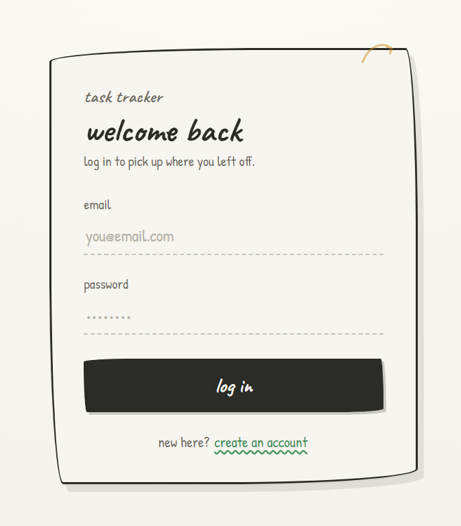

# Task Tracker

A task and habit tracker with a hand-drawn, notebook-style interface. Built with Next.js and Supabase — create an account, log in from any device, and your tasks are always in sync.

**Live:** https://task-tracker-navy-five-21.vercel.app

---

## Features

- **One-off tasks** with optional deadlines. Each task shows a live ETA ("3 days", "~2 months") and flags items that are due soon or overdue.
- **Smart sorting** — active tasks ordered by nearest deadline; completed tasks drop into a separate section ordered by most recently finished.
- **Recurring habits** with daily, weekday, weekly (pick a day), and monthly schedules. Each habit knows whether it's due today and can be ticked off once per cycle.
- **Two views** — a flat task list and a 7-day week grid you can navigate forward and back, with tasks placed on their deadline day.
- **Delete confirmation** so active tasks aren't removed by accident.
- **Auth + cloud sync** — tasks and habits are tied to your account and persist across devices and browsers.
- **Responsive** — the three-pane layout collapses into a single column on narrow screens.

---

## Tech

- **Next.js 15** (App Router) + **TypeScript**
- **Supabase** — Postgres database, Auth, Row Level Security
- **Tailwind CSS** + hand-drawn custom CSS (Caveat & Patrick Hand fonts)
- **Vercel** for deployment

---

## Running locally

```bash
git clone https://github.com/uzeyir-bayramli-3379/task-tracker.git
cd task-tracker
npm install
```

Create a `.env.local` file in the root:

```env
NEXT_PUBLIC_SUPABASE_URL=your_supabase_project_url
NEXT_PUBLIC_SUPABASE_ANON_KEY=your_supabase_anon_key
```

Then:

```bash
npm run dev
# visit http://localhost:3000
```

---

## Database setup

Run the following in your Supabase SQL editor:

```sql
-- Tasks
create table if not exists public.tasks (
  id           uuid primary key default gen_random_uuid(),
  user_id      uuid not null references auth.users (id) on delete cascade default auth.uid(),
  name         text not null,
  deadline     date,
  done         boolean not null default false,
  completed_at timestamptz,
  created_at   timestamptz not null default now()
);

alter table public.tasks enable row level security;
create policy "tasks are private to their owner"
  on public.tasks for all
  using (auth.uid() = user_id)
  with check (auth.uid() = user_id);

-- Recurring habits
create table if not exists public.recurring (
  id         uuid primary key default gen_random_uuid(),
  user_id    uuid not null references auth.users (id) on delete cascade default auth.uid(),
  name       text not null,
  freq       text not null check (freq in ('daily', 'weekdays', 'weekly', 'monthly')),
  weekday    int  not null default 0,
  last_done  date,
  created_at timestamptz not null default now()
);

alter table public.recurring enable row level security;
create policy "recurring habits are private to their owner"
  on public.recurring for all
  using (auth.uid() = user_id)
  with check (auth.uid() = user_id);
```

---

## Project structure

```
task-tracker/
├── app/
│   ├── layout.tsx        # fonts, metadata
│   ├── page.tsx          # main app (tasks + recurring + week view)
│   ├── globals.css       # hand-drawn sketch styles
│   └── login/
│       └── page.tsx      # auth page (login + signup)
├── utils/
│   └── supabase/
│       ├── client.ts     # browser Supabase client
│       └── server.ts     # server-side Supabase client
├── proxy.ts              # auth middleware (route protection)
├── supabase/
│   └── schema.sql        # database schema
└── legacy/
    └── index.html        # original vanilla HTML version
```

---

## Roadmap

- [ ] Web push notifications for upcoming deadlines
- [ ] Gmail reminders as fallback
- [ ] Mobile app (React Native + Expo)
- [ ] Home screen widget
- [ ] Edit tasks in place
- [ ] Tags / categories with filtering

---

## Screenshots

  

---

Built by [Uzeyir Bayramli](https://github.com/uzeyir-bayramli-3379).
